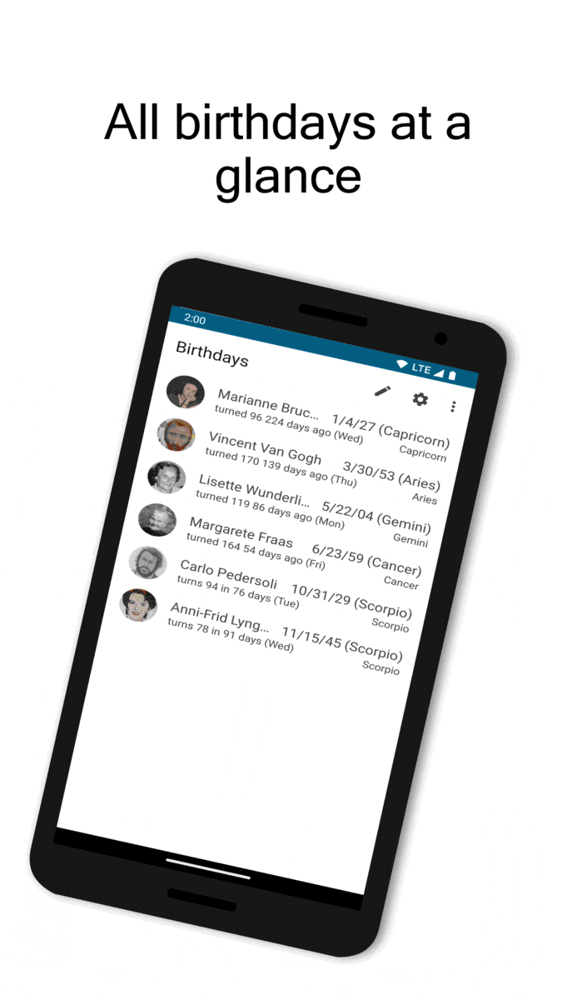

<strong>TKBirthdayReminder</strong> is a simple, yet beautiful birthday list. Never forget about the birthdays of the ones you care for. Place a widget on your home screen and receive reminders about upcoming birthdays once a day. Customize the app to your needs, for example when to remind you. You can even set on which days ahead of a birthday you want to receive additional notifications.

Also important:

<ul>
<li>No in-app purchases</li>
<li>No ads</li>
<li>No need to unlock anything</li>
<li>We respect your privacy</li>
<li>Completely <a href="https://github.com/tkuenneth/tkbirthdayreminder">open source</a></li>
</ul>

Download now!

